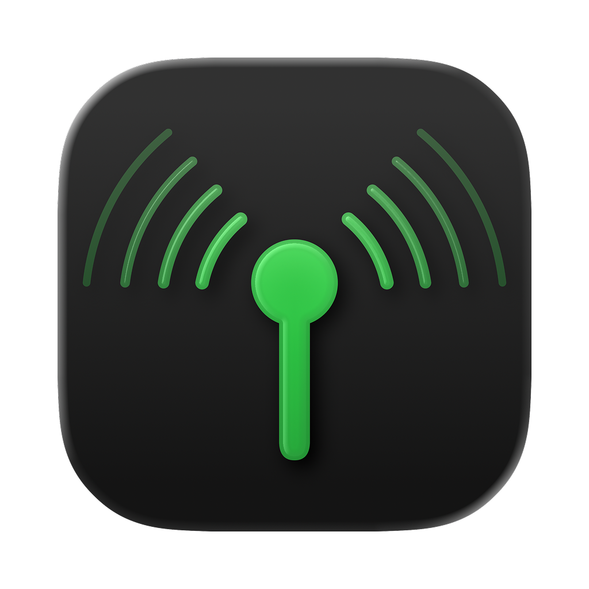
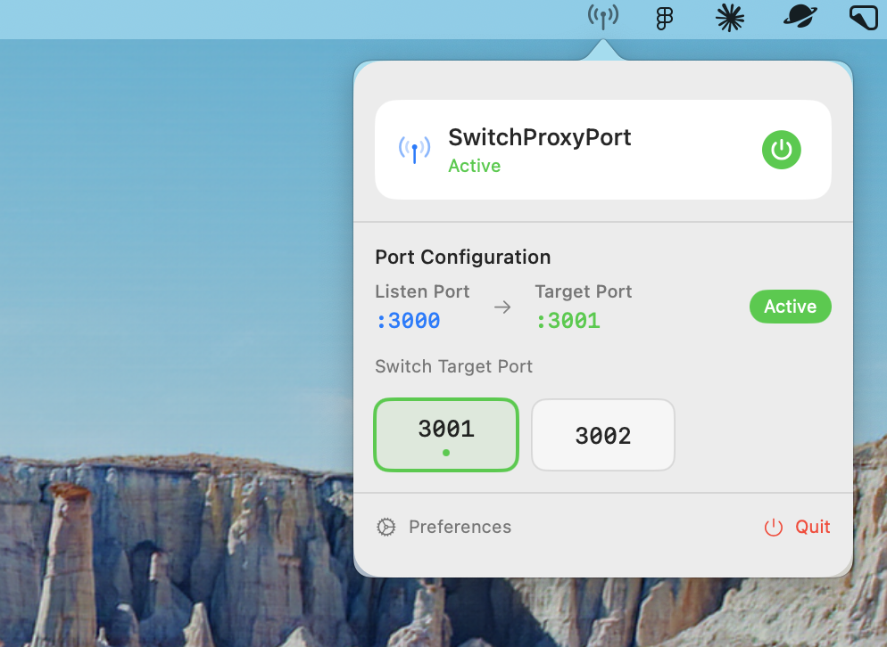

# 🔄 SwitchProxyPort

[](https://www.apple.com/macos/)
[](https://swift.org/)
[](LICENSE)

A modern macOS menu bar application for dynamic HTTP/TCP proxy server port switching. Perfect for developers who need to quickly switch between different local development servers.

<p align="center">
  
</p>

## 📸 Screenshots

<p align="center">
  
  <br>
  <em>Modern SwiftUI interface with intuitive port switching controls</em>
</p>

## ✨ Features

- 🌐 **HTTP/TCP Proxy Server** - Listen on a fixed port (default: 8080) and forward requests to configurable target ports
- 🔄 **Dynamic Port Switching** - Instantly switch between multiple target ports without restarting
- 📍 **Menu Bar Integration** - Native macOS status bar application with intuitive controls
- ⚙️ **Modern Preferences UI** - Apple HIG-compliant settings window with real-time validation
- 💾 **Persistent Configuration** - Automatically saves and restores your settings
- 🎯 **Visual Status Indicators** - Clear on/off states and active port highlighting
- ⌨️ **Keyboard Shortcuts** - Quick access with customizable hotkeys

## 🚀 Quick Start

### Installation

#### Option 1: Download from GitHub Releases (Recommended)
1. Go to the [Releases page](https://github.com/sskmy1024y/switch-proxy-port/releases)
2. Download the latest `SwitchProxyPort.dmg` file
3. Open the DMG and drag SwitchProxyPort to your Applications folder
4. Launch from Applications or Spotlight

#### Option 2: Build from Source Code
```bash
# Clone the repository
git clone https://github.com/sskmy1024y/switch-proxy-port.git
cd switch-proxy-port

# Build the application
cd SwitchProxyPort
./build-app.sh

# Launch the app
open SwitchProxyPort.app
```

#### Option 3: Development Mode
```bash
# Clone and run in development mode
git clone https://github.com/sskmy1024y/switch-proxy-port.git
cd switch-proxy-port/SwitchProxyPort
./run.sh
```

### Basic Usage

1. **Launch** - The app appears in your menu bar with a proxy icon
2. **Enable Proxy** - Click the menu bar icon and select "🟢 Turn On"
3. **Switch Targets** - Choose from available target ports in the "Target Ports" submenu
4. **Configure** - Access "⚙️ Preferences..." for advanced settings

## 🛠️ Configuration

### Default Settings
- **Listen Port**: `8080`
- **Target Ports**: `3000`, `3001`, `3002`
- **Initial State**: Disabled

### Browser Setup
Configure your browser's proxy settings:
- **HTTP Proxy**: `127.0.0.1:8080`
- **HTTPS Proxy**: `127.0.0.1:8080`

### Preferences Window
- **Listen Port**: Change the proxy server's listening port
- **Target Ports**: Add/remove forwarding destinations
- **Auto Start**: Enable automatic startup on login *(coming soon)*

## 🏗️ Architecture

```
SwitchProxyPort/
├── 📱 AppDelegate.swift          # Application lifecycle management
├── 📊 StatusBarController.swift  # Menu bar interface
├── 🔧 ProxyServer.swift         # Core proxy functionality  
├── ⚙️ ConfigManager.swift       # Settings persistence
├── 🎨 ModernPreferencesWindowController.swift  # Settings UI
└── 📋 ProxyConfig.swift         # Configuration data model
```

### Key Components

- **ProxyServer**: Handles HTTP/TCP forwarding using Network framework
- **StatusBarController**: Manages menu bar UI with modern icons and shortcuts
- **ConfigManager**: JSON-based configuration with automatic persistence
- **ModernPreferencesWindowController**: Apple HIG-compliant settings interface

## 🎨 UI Features

### Menu Bar Interface
- 🟢/⚪ **Visual Status**: Green/white icons indicate proxy state
- 📡 **Status Display**: Shows listening and forwarding port information
- 🎯 **Target Selection**: Submenu with active port highlighting
- ⌨️ **Keyboard Shortcuts**: Quick access (Cmd+T, Cmd+Q, Cmd+,)

### Preferences Window
- 🎨 **Modern Design**: Full-size content view with transparent title bar
- 📝 **Input Validation**: Real-time port number validation
- 🔧 **Easy Management**: Add/remove target ports with visual feedback
- 📊 **Status Messages**: Success/error feedback with auto-dismiss

## 🔧 Development

### Requirements
- macOS 12.0 or later
- Swift 5.7 or later
- Xcode 14.0 or later

### Building from Source
```bash
# Clone the repository
git clone <repository-url>
cd switch-proxy-port

# Build debug version
cd SwitchProxyPort
swift build

# Run in development mode
./.build/debug/SwitchProxyPort
```

### Project Structure
- **SwitchProxyPort/**: Swift Package Manager project
- **assets/**: Application icons and resources
- **DESIGN_SPEC.md**: Detailed technical specifications

### Scripts
- `build-app.sh` - Create release app bundle
- `create-dmg.sh` - Generate DMG installer
- `run.sh` - Development mode launcher
- `test-proxy.sh` - Proxy functionality testing

## 📦 Distribution

The application supports multiple distribution methods:

- **App Bundle**: `SwitchProxyPort.app` for direct installation
- **DMG Package**: Professional installer with drag-to-Applications
- **Development Build**: Direct execution from build directory

See `DISTRIBUTION.md` for detailed packaging instructions.

## 🤝 Contributing

1. Fork the repository
2. Create a feature branch (`git checkout -b feature/amazing-feature`)
3. Commit your changes (`git commit -m 'Add amazing feature'`)
4. Push to the branch (`git push origin feature/amazing-feature`)
5. Open a Pull Request

## 📋 System Requirements

- **Operating System**: macOS 12.0 (Monterey) or later
- **Architecture**: Intel x64 or Apple Silicon (Universal Binary)
- **Memory**: 50 MB RAM (typical usage)
- **Network**: Local proxy functionality only

## 🔒 Security & Privacy

- **Local Operation**: All proxy traffic remains on your local machine
- **No Data Collection**: No analytics or telemetry
- **Minimal Permissions**: Only requires network binding privileges
- **Open Source**: Full source code available for audit

## 📄 License

This project is licensed under the MIT License - see the [LICENSE](LICENSE) file for details.

## 🙏 Acknowledgments

- Built with Apple's Network framework for robust proxy functionality
- UI design follows Apple Human Interface Guidelines
- Icons designed using Apple's SF Symbols principles

---

<p align="center">
  Made with ❤️ for macOS developers
</p>
